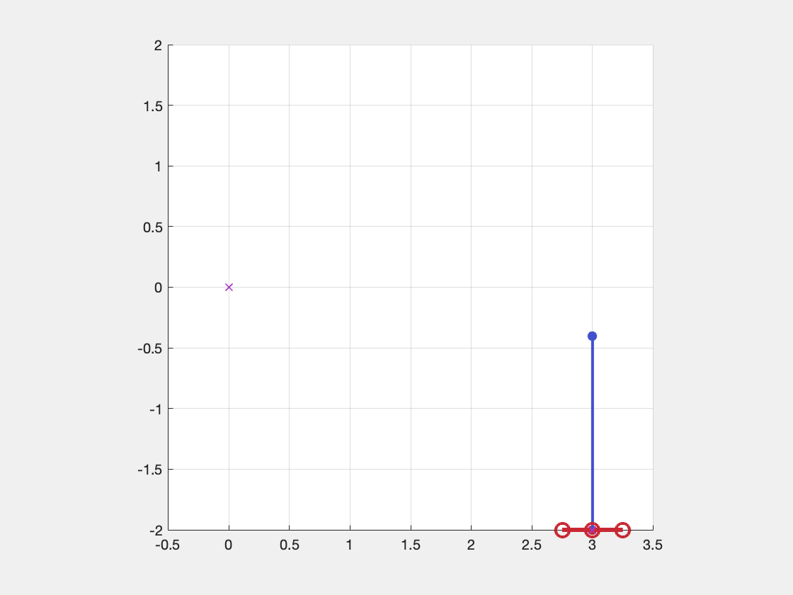
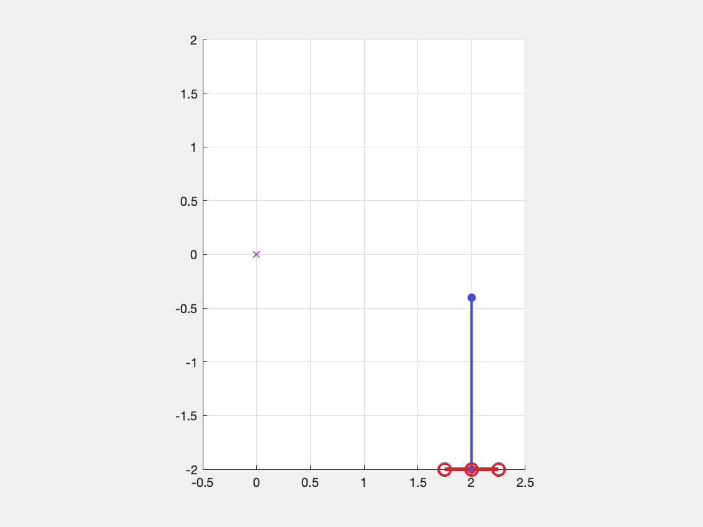
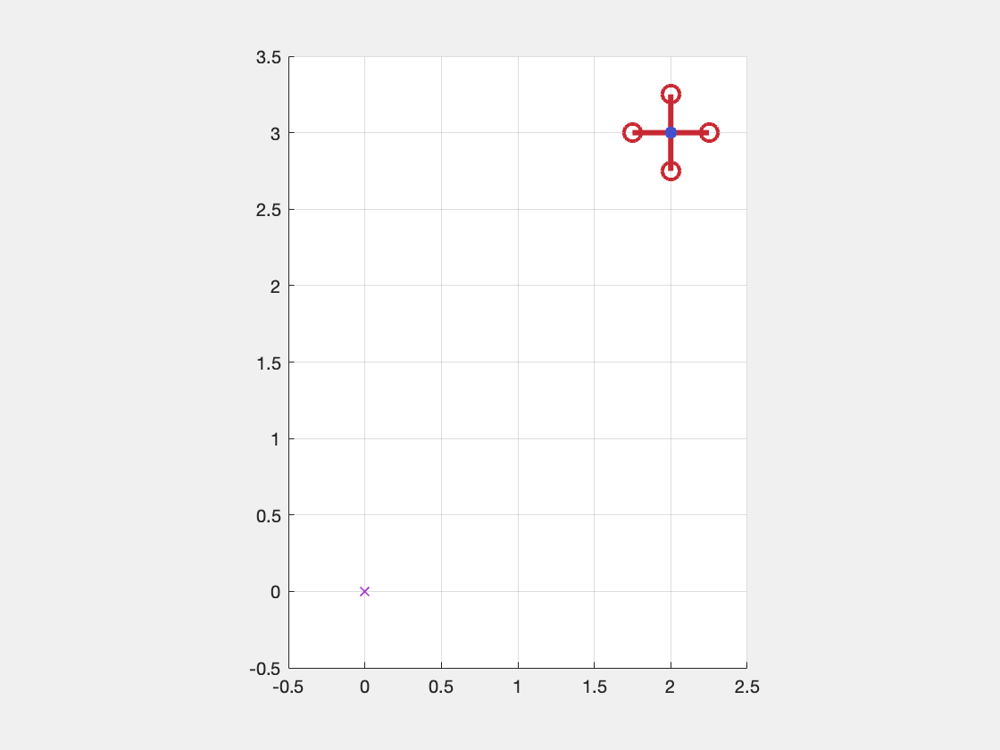
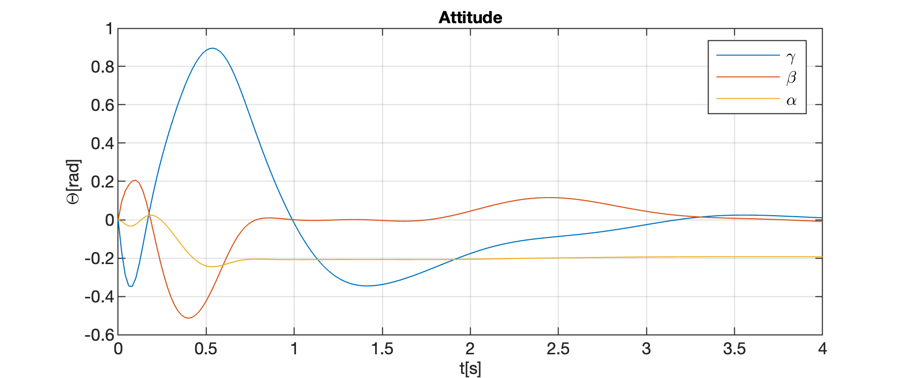
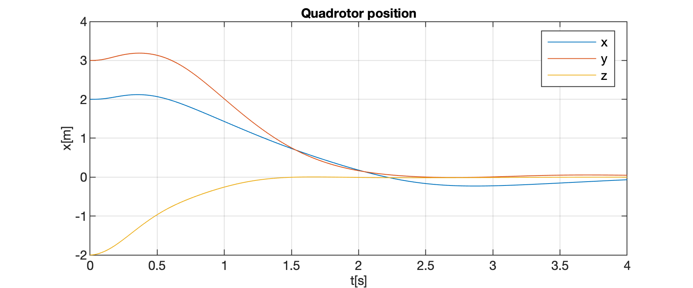
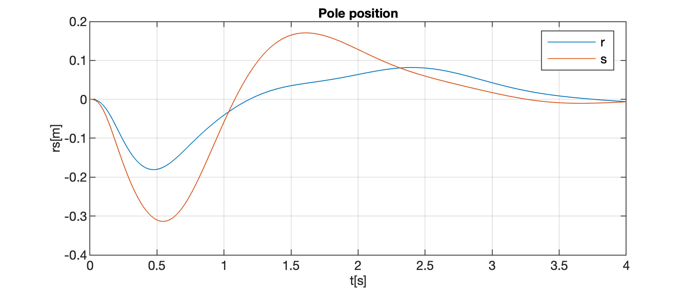

# flying-inverted-pendulum
Matlab simulation of a flying inverted pendulum. The implementation is based on M. Hehn and R. D’Andrea "A Flying Inverted Pendulum". The simulation consists of a script for initializing the simulation and finding the LQR gains, a Simulink simulation of the quadrotor + pendulum dynamics and a script for animating and plotting the simulation results. 

## Results
### Constant position regulation

| | | |
|:-------------------------:|:-------------------------:|:-------------------------:|
|  xz |   yz| xy|

Constant position regulation with sinusoidal input

### Circular trajectory tracking
Coming soon
